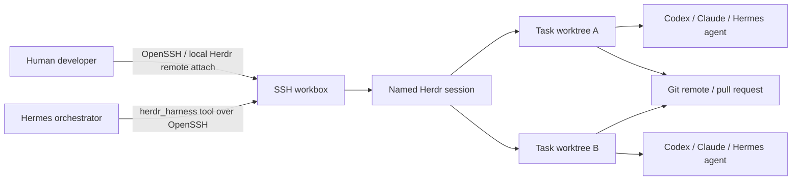

# Herdr + Hermes Team Coding Harness

This integration turns Herdr into the persistent terminal harness for Hermes and a development team. It is designed for long-running coding agents, SSH workboxes, isolated Git worktrees, human supervision, and recovery after network or client disconnects.

## Architecture



The trust boundary is intentionally simple:

- **SSH is the transport.** Only authenticated OpenSSH users reach the workbox.
- **Herdr is the harness.** It owns persistent terminal sessions, panes, agent detection, and reconnects.
- **Hermes is the orchestrator.** It creates isolated tasks, starts agents, monitors state, and applies its normal command-approval guard.
- **Git is the collaboration boundary.** Concurrent work is merged through branches and pull requests, not by sharing one writable checkout.

The Herdr local socket is never exposed over TCP.

## Repository Components

| Path | Purpose |
|---|---|
| `deploy/herdr-harness/plugin/controller.py` | Standard-library local/SSH controller |
| `deploy/herdr-harness/plugin/__init__.py` | Native Hermes `herdr_harness` tool |
| `deploy/herdr-harness/plugin/plugin.yaml` | Hermes plugin manifest |
| `scripts/bootstrap_herdr_harness.sh` | Idempotent server/client installation |
| `deploy/herdr-harness/profile.example.ini` | Harness profile template |
| `deploy/herdr-harness/ssh_config.example` | OpenSSH alias template |
| `deploy/herdr-harness/hermes.env.example` | Hermes process environment template |
| `skills/autonomous-ai-agents/herdr-harness/SKILL.md` | Agent operating policy and workflow |

## Supported Deployment Modes

### A. Hermes runs on a controller machine

The controller profile contains an SSH target such as `hermes-bot-workbox`. The plugin invokes `herdr-hermesctl`, which connects to the workbox and runs Herdr control commands there.

Use this mode when Hermes runs in a central gateway, desktop, or management VM.

### B. Hermes runs on the workbox

The profile leaves `target` blank. The plugin and controller invoke Herdr locally, while developers still attach through SSH.

Use this mode when the Hermes gateway and coding agents live on the same server.

The existing Hermes terminal backend can independently remain `local` or `ssh`. The native Herdr plugin does not depend on terminal-tool state; its profile is the source of truth for the harness location.

## Team Topology

The safe default is:

- one Unix account and SSH key per developer;
- one named Herdr session per developer and project;
- one dedicated `hermes-bot` Unix account and session for the orchestrator;
- one worktree per active task/agent;
- one shared Git remote for integration.

Example sessions:

```text
hermes-hermes-agent-alice
hermes-hermes-agent-bob
hermes-hermes-agent-hermes-bot
```

Do not distribute the `hermes-bot` private key to developers. Do not use a single shared Unix account for normal team work. A deliberately shared session is acceptable only for temporary pairing or incident response, with explicit control/takeover coordination.

## Host Prerequisites

The workbox needs:

- Linux or macOS supported by Herdr;
- OpenSSH server and public-key authentication;
- Python 3;
- Git;
- Herdr;
- each desired coding-agent CLI and its authentication;
- repository access for the Unix user running that session.

Recommended filesystem layout:

```text
/srv/hermes/projects/hermes-agent
/srv/hermes/worktrees/alice
/srv/hermes/worktrees/bob
/srv/hermes/worktrees/hermes-bot
```

Each user's worktree root must be writable only by that user unless the host has a deliberate group/ACL policy.

## SSH Setup

Copy the relevant block from `deploy/herdr-harness/ssh_config.example` into `~/.ssh/config`, replace the example address and key, then verify:

```bash
ssh hermes-workbox 'id && git --version'
```

Use an SSH alias because Herdr remote attach consumes normal OpenSSH configuration. Put custom ports, identity files, proxy jumps, and host-key policy in that alias.

Required security posture:

- public-key authentication;
- no shared private keys;
- `IdentitiesOnly yes`;
- server-side password login disabled where operationally possible;
- host firewall exposing SSH only to approved networks or a VPN;
- short-lived SSH certificates preferred for larger teams;
- no agent API keys in repository files.

## Install on the Workbox

Run from the checked-out `hermes-agent` repository as the target Unix user:

```bash
./scripts/bootstrap_herdr_harness.sh \
  --mode server \
  --profile hermes-bot \
  --session hermes-hermes-agent-hermes-bot \
  --repo-dir /srv/hermes/projects/hermes-agent \
  --repo-url git@github.com:ORG/hermes-agent.git \
  --worktrees-root /srv/hermes/worktrees/hermes-bot \
  --base-ref main
```

The bootstrap:

1. verifies Python and Git;
2. installs Herdr from its stable installer when absent;
3. installs the Hermes user plugin under `~/.hermes/plugins/herdr-harness`;
4. creates `~/.local/bin/herdr-hermesctl`;
5. writes a non-secret profile under `~/.config/herdr-harness`;
6. clones or validates the repository;
7. ensures a root Herdr workspace;
8. runs the harness doctor.

It does not create Unix accounts, edit `sshd_config`, install agent CLIs, or store credentials.

## Install on a Developer or Controller Machine

```bash
./scripts/bootstrap_herdr_harness.sh \
  --mode client \
  --profile hermes-alice \
  --target hermes-workbox \
  --session hermes-hermes-agent-alice \
  --repo-dir /srv/hermes/projects/hermes-agent \
  --worktrees-root /srv/hermes/worktrees/alice \
  --base-ref main
```

A client profile stores remote paths, so `repo` and `worktrees_root` must be absolute.

Verify and attach:

```bash
herdr-hermesctl --profile hermes-alice doctor
herdr-hermesctl --profile hermes-alice attach
```

`attach` uses the local Herdr client and SSH alias, preserving local clipboard behavior. Use `attach --via-ssh` when a local Herdr client is unavailable.

## Enable in Hermes

The bootstrap installs a user plugin, which Hermes discovers automatically. Configure the process environment:

```bash
HERDR_HARNESS_PROFILE=hermes-bot
HERDR_HARNESS_AUTO_ENABLE=1
```

Restart Hermes after installing or updating the plugin. The tool should appear as `herdr_harness` in the `herdr` toolset and is automatically appended to standard Hermes CLI, ACP, and messaging toolsets unless `HERDR_HARNESS_AUTO_ENABLE=0`.

Run this as the first tool call:

```text
herdr_harness(action="doctor", profile="hermes-bot")
```

Keep Hermes command approvals enabled. `pane_run` is checked by the same consolidated dangerous-command/Tirith guard used by the terminal tool.

## Daily Workflow

### Create a task worktree

```bash
herdr-hermesctl --profile hermes-bot --json task-create issue-142-auth-timeout \
  --branch agent/issue-142-auth-timeout \
  --base main \
  --label issue-142
```

The JSON response includes the worktree path and, when supplied by Herdr, the new workspace and root pane IDs.

### Start an agent

```bash
herdr-hermesctl --profile hermes-bot --json agent-start \
  issue-142 codex '<pane-id>'
```

### Prompt and wait

```bash
herdr-hermesctl --profile hermes-bot --json agent-prompt \
  issue-142 \
  'Fix issue #142, add a regression test, run focused tests, and summarize risk.' \
  --wait-timeout-ms 180000
```

### Inspect

```bash
herdr-hermesctl --profile hermes-bot --json agent-read issue-142 --lines 300
herdr-hermesctl --profile hermes-bot --json worktree-list
herdr-hermesctl --profile hermes-bot --json pane-list
```

### Validate in the existing pane

```bash
herdr-hermesctl --profile hermes-bot pane-run '<pane-id>' \
  'git status --short && pytest -q tests/path/to/test.py'
herdr-hermesctl --profile hermes-bot pane-read '<pane-id>' --lines 300
```

Interactive agent CLIs must be started with `agent-start`, not `pane-run`.

## Concurrency Rules

1. One active agent per worktree.
2. Branch and path names must be unique per task.
3. Two parallel tasks should not own the same files. If unavoidable, serialize them.
4. Agents never work directly in the root checkout used to update the base branch.
5. A worktree is removed only after its branch is pushed and the task is integrated or intentionally abandoned.
6. Force removal requires explicit approval and remains disabled in normal operations.

## Recovery

After a laptop, SSH, Hermes, or network disconnect:

```bash
herdr-hermesctl --profile hermes-bot status
herdr-hermesctl --profile hermes-bot agent-list
herdr-hermesctl --profile hermes-bot worktree-list
```

Herdr keeps the terminal session alive. Reuse the existing IDs. Do not create a duplicate task until checking the original agent and worktree.

For a blocked agent:

```bash
herdr-hermesctl --profile hermes-bot agent-read issue-142 --lines 300
herdr-hermesctl --profile hermes-bot agent-keys issue-142 esc
```

Read first; send control keys only when the terminal state is understood.

## Troubleshooting

### Doctor reports SSH failure

Run `ssh <alias> true`. Check identity selection, host key, VPN/firewall, and `BatchMode` compatibility. The harness does not support interactive password prompts.

### Remote attach ignores a custom key or port

Move those settings into the OpenSSH alias. The control commands can use profile key/port values, but Herdr's native remote attach uses OpenSSH configuration.

### Workspace path mismatch

Inspect the resolved profile:

```bash
herdr-hermesctl --profile hermes-bot config-show
```

Remote paths must be absolute and must match the path visible to Git and Herdr on the workbox.

### Agent start times out

Verify the CLI is installed and authenticated for that Unix user. The target pane must be at an interactive shell prompt, not inside another process.

### Tool does not appear in Hermes

Confirm:

```bash
ls ~/.hermes/plugins/herdr-harness/{plugin.yaml,__init__.py,controller.py}
python3 -m py_compile ~/.hermes/plugins/herdr-harness/{__init__.py,controller.py}
```

Then restart Hermes and check `HERDR_HARNESS_AUTO_ENABLE`.

## Acceptance Checklist

The harness is production-ready for a team when:

- every user authenticates with an individual SSH identity;
- `doctor` passes for the bot and each developer profile;
- disconnect/reconnect preserves an active agent;
- two parallel sample tasks produce different worktrees and branches;
- Hermes can start, prompt, wait for, and read an agent;
- dangerous `pane_run` commands enter the Hermes approval path;
- repository secrets are absent from profiles and prompts;
- branch protection and pull-request review are enabled on the Git remote;
- backups/retention exist for the workbox or all valuable changes are pushed promptly.
