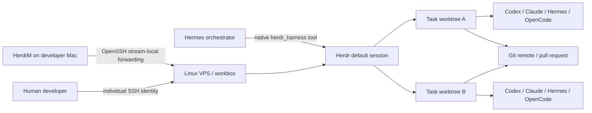

# Herdr + Hermes Team Coding Harness

This integration turns Herdr into a persistent terminal harness for Hermes and a development team. It supports long-running coding agents, SSH workboxes, isolated Git worktrees, human supervision, HerdrM on macOS, and recovery after network or client disconnects.

Portuguese team runbook: [`herdr-hermes-equipe.pt-BR.md`](./herdr-hermes-equipe.pt-BR.md).

## Architecture Decision

Run the **primary Herdr server and coding agents on a VPS/workbox**. Run **HerdrM on each developer's Mac** as the native console. A local Mac Herdr remains useful for short experiments, but it is not the durable team runtime.



The trust boundary is intentionally simple:

- **SSH is the transport.** Only authenticated OpenSSH users reach the workbox.
- **Herdr is the harness.** It owns persistent PTYs, workspaces, panes, agent detection, and reconnects.
- **HerdrM is the console.** It aggregates local and SSH devices without replacing the real terminal.
- **Hermes is the orchestrator.** It creates tasks, starts agents, monitors state, and applies the normal command-approval guard.
- **Git is the collaboration boundary.** Concurrent work is integrated through branches and pull requests, not through one shared writable checkout.

The Herdr Unix socket is never exposed over TCP.

## HerdrM Compatibility and the Default Session

The current HerdrM SSH tunnel forwards the remote default socket:

```text
~/.config/herdr/herdr.sock
```

Therefore the primary team runtime uses:

```text
session = default
```

Projects and tasks are separated with Herdr workspaces and Git worktrees inside that default session. Named Herdr sessions remain available for special/manual isolation, but HerdrM does not currently expose a remote named session as a separate device.

## Repository Components

| Path | Purpose |
|---|---|
| `deploy/herdr-harness/plugin/controller.py` | Standard-library local/SSH controller |
| `deploy/herdr-harness/plugin/__init__.py` | Native Hermes `herdr_harness` tool |
| `deploy/herdr-harness/plugin/plugin.yaml` | Hermes plugin manifest |
| `scripts/bootstrap_herdr_harness.sh` | Idempotent server/client bootstrap and systemd user service |
| `scripts/configure_herdrm.py` | Safe HerdrM device inventory management and SSH alias discovery |
| `deploy/herdr-harness/profile.example.ini` | Harness profile template |
| `deploy/herdr-harness/ssh_config.example` | OpenSSH alias template |
| `deploy/herdr-harness/hermes.env.example` | Hermes process environment template |
| `skills/autonomous-ai-agents/herdr-harness/SKILL.md` | Agent operating policy |
| `tests/herdr_harness/` | Controller, plugin, and HerdrM configurator tests |

## Deployment Modes

### Workbox mode — recommended

Hermes and Herdr run on the same VPS. The harness profile leaves `target` blank. Developers connect to their own Unix accounts through SSH and HerdrM.

### Controller mode

Hermes runs on another gateway, desktop, or management VM. The harness profile contains an SSH alias such as `hermes-bot-workbox`; the plugin executes Herdr control commands on that host.

The ordinary Hermes terminal backend can independently remain `local` or `ssh`. The Herdr harness profile is the authority for the persistent agent runtime.

## Mandatory Team Topology

Use:

- one Unix account and one SSH identity per developer;
- one dedicated `hermes-bot` Unix account and SSH identity;
- one repository clone per Unix account;
- the default Herdr session for each account's primary runtime;
- one worktree per active task/agent;
- one shared Git remote for integration.

Do **not** share one clone's `.git` directory between normal Unix accounts. Git worktrees write administrative files and locks under the source clone; cross-user sharing causes ownership, permission, and lock contention.

Recommended layout:

```text
/srv/hermes/users/alice/projects/hermes-agent
/srv/hermes/users/alice/worktrees/hermes-agent
/srv/hermes/users/bob/projects/hermes-agent
/srv/hermes/users/bob/worktrees/hermes-agent
/srv/hermes/users/hermes-bot/projects/hermes-agent
/srv/hermes/users/hermes-bot/worktrees/hermes-agent
```

Do not distribute the `hermes-bot` private key to developers. HerdrM provides interactive terminal control, not a strict read-only remote mode, so the bot account must not become a shared team console.

## Host Prerequisites

The recommended workbox needs:

- Linux with systemd;
- OpenSSH server with public-key authentication;
- `AllowStreamLocalForwarding yes` for HerdrM's Unix-socket tunnel;
- Python 3 and Git;
- Herdr;
- every desired coding-agent CLI and its authentication;
- Git remote access for the Unix account that owns each clone.

Each account's project and worktree directories should be owned by that account. Use a group or ACL only when the operational model deliberately requires shared read access.

## SSH Setup

Copy the relevant block from `deploy/herdr-harness/ssh_config.example` into `~/.ssh/config`, replace the example address and key, then verify:

```bash
ssh hermes-workbox 'id; command -v herdr; herdr --version'
```

Use an SSH alias because both the harness and HerdrM consume normal OpenSSH configuration. Put custom ports, identity files, ProxyJump, VPN hostnames, and host-key policy in that alias.

Required security posture:

- public-key authentication;
- no shared private keys;
- `IdentitiesOnly yes`;
- server-side password login disabled where operationally possible;
- firewall or VPN restricting SSH exposure;
- short-lived SSH certificates preferred for larger teams;
- no API keys or credentials in repository profile files.

## Install the Hermes Bot Runtime on the VPS

Run from this repository as the `hermes-bot` Unix user:

```bash
./scripts/bootstrap_herdr_harness.sh \
  --mode server \
  --profile hermes-bot \
  --session default \
  --repo-dir /srv/hermes/users/hermes-bot/projects/hermes-agent \
  --repo-url git@github.com:ORG/hermes-agent.git \
  --worktrees-root /srv/hermes/users/hermes-bot/worktrees/hermes-agent \
  --base-ref main
```

The bootstrap:

1. validates Python, Git, profile/session names, and client-mode SSH;
2. installs Herdr from the stable installer when absent;
3. installs the Hermes user plugin under `~/.hermes/plugins/herdr-harness`;
4. compiles the plugin and controller before enabling them;
5. creates `~/.local/bin/herdr-hermesctl`;
6. writes a non-secret profile under `~/.config/herdr-harness` with mode `0600`;
7. clones or validates the account-owned repository;
8. installs and starts `herdr-<profile>.service` as a systemd user service;
9. attempts to enable user linger for boot/logout persistence;
10. ensures a root workspace and runs the harness doctor.

Validate:

```bash
systemctl --user status herdr-hermes-bot.service
herdr --session default status --json
herdr-hermesctl --profile hermes-bot doctor
```

If the bootstrap reports `enabled-existing-server`, a Herdr server was already running outside systemd. Preserve its active agents, stop it during a controlled window, then start the service:

```bash
systemctl --user start herdr-hermes-bot.service
```

On a non-systemd host, pass `--skip-service` and supervise this command with the platform's native process manager:

```bash
herdr --session default server
```

## Install Each Developer Runtime on the VPS

Run server mode while logged in as that developer. Example:

```bash
./scripts/bootstrap_herdr_harness.sh \
  --mode server \
  --profile hermes-alice \
  --session default \
  --repo-dir /srv/hermes/users/alice/projects/hermes-agent \
  --repo-url git@github.com:ORG/hermes-agent.git \
  --worktrees-root /srv/hermes/users/alice/worktrees/hermes-agent \
  --base-ref main
```

Repeat with account-specific paths and profiles. Normal developer agents should not run under `hermes-bot`.

## Configure a Developer Mac and HerdrM

Run client mode from the same branch:

```bash
./scripts/bootstrap_herdr_harness.sh \
  --mode client \
  --profile hermes-alice \
  --target hermes-workbox \
  --session default \
  --repo-dir /srv/hermes/users/alice/projects/hermes-agent \
  --worktrees-root /srv/hermes/users/alice/worktrees/hermes-agent \
  --base-ref main \
  --configure-herdrm \
  --herdrm-device-name "Hermes Workbox — Alice"
```

The client profile stores remote paths, so `repo` and `worktrees_root` must be absolute. The HerdrM helper stores only the SSH target and display name; keys and credentials remain in OpenSSH, ssh-agent, Tailscale, or Keychain.

Quit and reopen HerdrM after inventory changes.

Verify the controller and console inventory:

```bash
herdr-hermesctl --profile hermes-alice doctor
python3 scripts/configure_herdrm.py list
python3 scripts/configure_herdrm.py doctor
```

## Add All Herdr-Enabled SSH Hosts to HerdrM

Import every concrete `Host` alias from `~/.ssh/config` whose default Herdr socket is running:

```bash
python3 scripts/configure_herdrm.py sync-ssh-config --probe
```

Filter aliases when the SSH config contains unrelated machines:

```bash
python3 scripts/configure_herdrm.py sync-ssh-config \
  --probe \
  --include '^(hermes-|dev-|vps-|workbox)'
```

Add one device explicitly:

```bash
python3 scripts/configure_herdrm.py add \
  --name "Papiro Workbox" \
  --target papiro-workbox \
  --probe
```

The helper follows OpenSSH `Include` files, ignores wildcard `Host` patterns, creates a timestamped backup, writes atomically, and keeps `devices.json` at mode `0600`.

## Enable the Native Tool in Hermes

Configure the Hermes process environment:

```bash
HERDR_HARNESS_PROFILE=hermes-bot
HERDR_HARNESS_AUTO_ENABLE=1
```

Restart Hermes after installing or updating the plugin. The tool appears as `herdr_harness` in the `herdr` toolset and is appended to standard Hermes CLI, ACP, and messaging toolsets unless auto-enable is disabled.

Run this first:

```text
herdr_harness(action="doctor", profile="hermes-bot")
```

Keep Hermes command approvals enabled. `pane_run` uses the consolidated dangerous-command/Tirith guard with host/SSH policy, even when the ordinary terminal backend is Docker or Modal.

## Daily Workflow

### 1. Create an isolated task worktree

```bash
herdr-hermesctl --profile hermes-alice --json task-create issue-142-auth-timeout \
  --branch agent/issue-142-auth-timeout \
  --base main \
  --label issue-142
```

Capture the returned worktree path, `workspace_id`, and `pane_id`.

### 2. Start an interactive coding agent

```bash
herdr-hermesctl --profile hermes-alice --json agent-start \
  issue-142 codex '<pane-id>'
```

Interactive coding CLIs must be started with `agent-start`, not `pane-run`.

### 3. Prompt and wait

```bash
herdr-hermesctl --profile hermes-alice --json agent-prompt \
  issue-142 \
  'Fix issue #142, add a regression test, run focused tests, and summarize risk.' \
  --wait-timeout-ms 180000
```

### 4. Inspect state and output

```bash
herdr-hermesctl --profile hermes-alice --json agent-get issue-142
herdr-hermesctl --profile hermes-alice --json agent-read issue-142 --lines 300
herdr-hermesctl --profile hermes-alice --json agent-wait \
  issue-142 --until idle --until done --until blocked --wait-timeout-ms 180000
```

### 5. Validate in the same worktree/pane

```bash
herdr-hermesctl --profile hermes-alice pane-run '<pane-id>' \
  'git status --short && pytest -q tests/path/to/test.py'
herdr-hermesctl --profile hermes-alice pane-read '<pane-id>' --lines 300
```

Push the branch and integrate through a pull request.

## Concurrency Rules

1. One active agent per worktree.
2. Branch and path names are unique per task.
3. Parallel tasks should not own the same files; serialize them if they do.
4. Agents never work directly in the root checkout used to refresh the base branch.
5. A worktree is removed only after its branch is pushed and the task is integrated or intentionally abandoned.
6. Forced removal requires explicit approval and is not exposed through the native model tool.
7. Cross-user integration happens through Git, not through a shared `.git` directory.
8. Read blocked-agent output before sending keys or granting approval.

## Recovery

After a Mac, SSH, Hermes, or network disconnect:

```bash
herdr-hermesctl --profile hermes-alice status
herdr-hermesctl --profile hermes-alice agent-list
herdr-hermesctl --profile hermes-alice worktree-list
```

On the VPS:

```bash
systemctl --user status herdr-hermes-alice.service
journalctl --user -u herdr-hermes-alice.service -n 200 --no-pager
```

Herdr keeps terminal processes alive across client disconnects. A physical VPS reboot terminates running child processes; the headless service restores saved session shape, after which native Codex/Claude sessions can be resumed where supported.

For a blocked agent:

```bash
herdr-hermesctl --profile hermes-alice agent-read issue-142 --lines 300
herdr-hermesctl --profile hermes-alice agent-keys issue-142 esc
```

## Troubleshooting

### HerdrM reports a missing remote server

Run:

```bash
ssh <alias> 'test -S "$HOME/.config/herdr/herdr.sock"; herdr status --json'
```

Confirm the systemd user service and `AllowStreamLocalForwarding yes`.

### Doctor reports SSH failure

Run `ssh <alias> true`. Check identity selection, host key, VPN/firewall, `BatchMode`, and whether the key is loaded into ssh-agent.

### Remote attach ignores a custom key or port

Move those settings into the OpenSSH alias. Herdr native remote attach and HerdrM both use normal OpenSSH configuration.

### Workspace path mismatch

Inspect the resolved profile:

```bash
herdr-hermesctl --profile hermes-bot config-show
```

Remote paths must be absolute and visible to Git and Herdr on the workbox.

### Permission or worktree-lock errors

Confirm that the current Unix account owns both the clone and worktree root. Create a separate clone/profile instead of pointing several accounts at one clone.

### Agent start times out

Verify the CLI is installed and authenticated for that Unix user. The target pane must be at an interactive shell prompt, not inside another process.

### Tool does not appear in Hermes

Confirm:

```bash
ls ~/.hermes/plugins/herdr-harness/{plugin.yaml,__init__.py,controller.py}
python3 -m py_compile ~/.hermes/plugins/herdr-harness/{__init__.py,controller.py}
```

Restart Hermes and check `HERDR_HARNESS_AUTO_ENABLE`.

## Acceptance Checklist

The harness is ready when:

- every user authenticates with an individual SSH identity;
- `AllowStreamLocalForwarding yes` is active;
- every Unix account owns its own repository clone and worktree root;
- the primary session is `default`;
- the Herdr systemd user service is active or an equivalent supervisor is configured;
- user linger or an equivalent boot policy is enabled;
- `doctor` passes for the bot and each developer profile;
- `configure_herdrm.py doctor` passes on each Mac;
- HerdrM shows the expected device and agents;
- disconnect/reconnect preserves an active remote agent;
- two parallel sample tasks produce different worktrees and branches;
- Hermes can create, start, prompt, wait for, and read an agent;
- dangerous `pane_run` commands enter the Hermes approval path;
- profiles and prompts contain no secrets;
- branch protection and pull-request review are enabled;
- valuable changes are pushed promptly or the workbox has a backup/retention policy.
