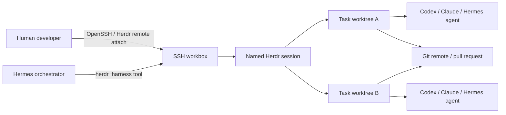

# Herdr + Hermes Team Coding Harness

This integration turns Herdr into the persistent terminal harness for Hermes and a development team. It supports long-running coding agents, SSH workboxes, isolated Git worktrees, human supervision, and recovery after network or client disconnects.

## Architecture



The trust boundary is intentionally simple:

- **SSH is the transport.** Only authenticated OpenSSH users reach the workbox.
- **Herdr is the harness.** It owns persistent terminal sessions, panes, agent detection, and reconnects.
- **Hermes is the orchestrator.** It creates tasks, starts agents, monitors state, and applies the normal command-approval guard.
- **Git is the collaboration boundary.** Concurrent work is merged through branches and pull requests, not through one shared writable checkout.

The Herdr local socket is never exposed over TCP.

## Repository Components

| Path | Purpose |
|---|---|
| `deploy/herdr-harness/plugin/controller.py` | Standard-library local/SSH controller |
| `deploy/herdr-harness/plugin/__init__.py` | Native Hermes `herdr_harness` tool |
| `deploy/herdr-harness/plugin/plugin.yaml` | Hermes plugin manifest |
| `scripts/bootstrap_herdr_harness.sh` | Idempotent server/client installation |
| `deploy/herdr-harness/profile.example.ini` | Harness profile template |
| `deploy/herdr-harness/ssh_config.example` | OpenSSH alias template |
| `deploy/herdr-harness/hermes.env.example` | Hermes process environment template |
| `skills/autonomous-ai-agents/herdr-harness/SKILL.md` | Agent operating policy |
| `tests/herdr_harness/` | Focused controller and plugin tests |

## Supported Deployment Modes

### Controller mode

Hermes runs on a gateway, desktop, or management VM. The harness profile contains an SSH target such as `hermes-bot-workbox`; the plugin executes Herdr control commands on that host.

### Workbox mode

Hermes and Herdr run on the same workbox. The profile leaves `target` blank, while developers still connect through SSH.

The existing Hermes terminal backend may independently remain `local` or `ssh`. The Herdr profile is the source of truth for the harness location.

## Mandatory Team Topology

The safe default is:

- one Unix account and one SSH identity per developer;
- one dedicated `hermes-bot` Unix account and SSH identity;
- one repository clone per Unix account;
- one named Herdr session per project and Unix account;
- one worktree per active task/agent;
- one shared Git remote for integration.

Do **not** share the same clone's `.git` directory between normal Unix accounts. Git worktrees write administrative files and locks under that clone; cross-user sharing causes ownership, permission, and lock contention. Share code through the remote repository and pull requests instead.

Recommended layout:

```text
/srv/hermes/users/alice/projects/hermes-agent
/srv/hermes/users/alice/worktrees/hermes-agent
/srv/hermes/users/bob/projects/hermes-agent
/srv/hermes/users/bob/worktrees/hermes-agent
/srv/hermes/users/hermes-bot/projects/hermes-agent
/srv/hermes/users/hermes-bot/worktrees/hermes-agent
```

Example session names:

```text
hermes-hermes-agent-alice
hermes-hermes-agent-bob
hermes-hermes-agent-hermes-bot
```

Do not distribute the `hermes-bot` private key to developers. A deliberately shared session is acceptable only for temporary pairing or incident response, with explicit control/takeover coordination.

## Host Prerequisites

The workbox needs:

- Linux or macOS supported by Herdr;
- OpenSSH server with public-key authentication;
- Python 3;
- Git;
- Herdr;
- every desired coding-agent CLI and its authentication;
- Git remote access for the Unix account that owns each clone.

Each account's project and worktree directories should be owned by that account. Use a group or ACL only when the operational model deliberately requires shared read access.

## SSH Setup

Copy the relevant block from `deploy/herdr-harness/ssh_config.example` into `~/.ssh/config`, replace the example address and key, then verify:

```bash
ssh hermes-workbox 'id && git --version'
```

Use an SSH alias because Herdr remote attach consumes normal OpenSSH configuration. Put custom ports, identity files, proxy jumps, and host-key policy in that alias.

Required security posture:

- public-key authentication;
- no shared private keys;
- `IdentitiesOnly yes`;
- server-side password login disabled where operationally possible;
- host firewall exposing SSH only to approved networks or a VPN;
- short-lived SSH certificates preferred for larger teams;
- no API keys or credentials in repository profile files.

## Install for the Hermes Bot on the Workbox

Run from a checked-out `hermes-agent` repository as the `hermes-bot` Unix user:

```bash
./scripts/bootstrap_herdr_harness.sh \
  --mode server \
  --profile hermes-bot \
  --session hermes-hermes-agent-hermes-bot \
  --repo-dir /srv/hermes/users/hermes-bot/projects/hermes-agent \
  --repo-url git@github.com:ORG/hermes-agent.git \
  --worktrees-root /srv/hermes/users/hermes-bot/worktrees/hermes-agent \
  --base-ref main
```

The bootstrap:

1. validates Python, Git, session names, and client-mode SSH;
2. installs Herdr from its stable installer when absent;
3. installs the Hermes user plugin under `~/.hermes/plugins/herdr-harness`;
4. compiles the plugin and controller before enabling them;
5. creates `~/.local/bin/herdr-hermesctl`;
6. writes a non-secret profile under `~/.config/herdr-harness` with mode `0600`;
7. clones or validates the account-owned repository;
8. ensures a root Herdr workspace;
9. runs the harness doctor.

It does not create Unix accounts, edit `sshd_config`, install agent CLIs, or store credentials.

## Install for a Developer

First create the developer's own clone on the workbox by logging in as that developer and running server mode:

```bash
./scripts/bootstrap_herdr_harness.sh \
  --mode server \
  --profile hermes-alice \
  --session hermes-hermes-agent-alice \
  --repo-dir /srv/hermes/users/alice/projects/hermes-agent \
  --repo-url git@github.com:ORG/hermes-agent.git \
  --worktrees-root /srv/hermes/users/alice/worktrees/hermes-agent \
  --base-ref main
```

Then install the matching controller profile on Alice's laptop:

```bash
./scripts/bootstrap_herdr_harness.sh \
  --mode client \
  --profile hermes-alice \
  --target hermes-workbox \
  --session hermes-hermes-agent-alice \
  --repo-dir /srv/hermes/users/alice/projects/hermes-agent \
  --worktrees-root /srv/hermes/users/alice/worktrees/hermes-agent \
  --base-ref main
```

A client profile stores remote paths, so `repo` and `worktrees_root` must be absolute.

Verify and attach:

```bash
herdr-hermesctl --profile hermes-alice doctor
herdr-hermesctl --profile hermes-alice attach
```

`attach` uses the local Herdr client and SSH alias, preserving local clipboard behavior. Use `attach --via-ssh` when a local Herdr client is unavailable.

## Enable in Hermes

The bootstrap installs a user plugin, which Hermes discovers automatically. Configure the Hermes process environment:

```bash
HERDR_HARNESS_PROFILE=hermes-bot
HERDR_HARNESS_AUTO_ENABLE=1
```

Restart Hermes after installing or updating the plugin. The tool appears as `herdr_harness` in the `herdr` toolset and is automatically appended to standard Hermes CLI, ACP, and messaging toolsets unless `HERDR_HARNESS_AUTO_ENABLE=0`.

Run this as the first tool call:

```text
herdr_harness(action="doctor", profile="hermes-bot")
```

Keep Hermes command approvals enabled. `pane_run` uses the same consolidated dangerous-command/Tirith guard as the terminal tool.

## Daily Workflow

### 1. Create an isolated task worktree

```bash
herdr-hermesctl --profile hermes-bot --json task-create issue-142-auth-timeout \
  --branch agent/issue-142-auth-timeout \
  --base main \
  --label issue-142
```

Capture the returned worktree path, `workspace_id`, and `pane_id`.

### 2. Start an interactive coding agent

```bash
herdr-hermesctl --profile hermes-bot --json agent-start \
  issue-142 codex '<pane-id>'
```

Interactive coding CLIs must be started with `agent-start`, not `pane-run`.

### 3. Prompt and wait

```bash
herdr-hermesctl --profile hermes-bot --json agent-prompt \
  issue-142 \
  'Fix issue #142, add a regression test, run focused tests, and summarize risk.' \
  --wait-timeout-ms 180000
```

### 4. Inspect state and output

```bash
herdr-hermesctl --profile hermes-bot --json agent-wait \
  issue-142 --until idle --until done --until blocked --wait-timeout-ms 180000
herdr-hermesctl --profile hermes-bot --json agent-read issue-142 --lines 300
herdr-hermesctl --profile hermes-bot --json worktree-list
```

### 5. Validate in the same worktree/pane

```bash
herdr-hermesctl --profile hermes-bot pane-run '<pane-id>' \
  'git status --short && pytest -q tests/path/to/test.py'
herdr-hermesctl --profile hermes-bot pane-read '<pane-id>' --lines 300
```

Hermes applies command approval before `pane_run` when the native tool invokes it.

## Concurrency Rules

1. One active agent per worktree.
2. Branch and path names are unique per task.
3. Parallel tasks should not own the same files; serialize them if they do.
4. Agents never work directly in the root checkout used to refresh the base branch.
5. A worktree is removed only after its branch is pushed and the task is integrated or intentionally abandoned.
6. Forced removal requires explicit approval and is absent from normal automation unless requested.
7. Cross-user integration happens through Git, not through a shared `.git` directory.

## Recovery

After a laptop, SSH, Hermes, or network disconnect:

```bash
herdr-hermesctl --profile hermes-bot status
herdr-hermesctl --profile hermes-bot agent-list
herdr-hermesctl --profile hermes-bot worktree-list
```

Herdr keeps the terminal session alive. Reuse existing IDs. Do not create a duplicate task until checking the original agent and worktree.

For a blocked agent:

```bash
herdr-hermesctl --profile hermes-bot agent-read issue-142 --lines 300
herdr-hermesctl --profile hermes-bot agent-keys issue-142 esc
```

Read first; send control keys only after understanding the terminal state.

## Troubleshooting

### Doctor reports SSH failure

Run `ssh <alias> true`. Check identity selection, host key, VPN/firewall, and `BatchMode` compatibility. The harness does not support interactive password prompts.

### Remote attach ignores a custom key or port

Move those settings into the OpenSSH alias. Control commands can use profile key/port values, but Herdr's native remote attach uses OpenSSH configuration.

### Workspace path mismatch

Inspect the resolved profile:

```bash
herdr-hermesctl --profile hermes-bot config-show
```

Remote paths must be absolute and match the paths visible to Git and Herdr on the workbox.

### Permission or worktree-lock errors

Confirm that the current Unix account owns both the clone and worktree root. Do not point multiple Unix accounts at the same clone. Create a separate clone/profile for the affected user.

### Agent start times out

Verify the CLI is installed and authenticated for that Unix user. The target pane must be at an interactive shell prompt, not inside another process.

### Tool does not appear in Hermes

Confirm:

```bash
ls ~/.hermes/plugins/herdr-harness/{plugin.yaml,__init__.py,controller.py}
python3 -m py_compile ~/.hermes/plugins/herdr-harness/{__init__.py,controller.py}
```

Restart Hermes and check `HERDR_HARNESS_AUTO_ENABLE`.

## Acceptance Checklist

The harness is ready for team use when:

- every user authenticates with an individual SSH identity;
- every Unix account owns its own repository clone and worktree root;
- `doctor` passes for the bot and each developer profile;
- disconnect/reconnect preserves an active agent;
- two parallel sample tasks produce different worktrees and branches;
- Hermes can create, start, prompt, wait for, and read an agent;
- dangerous `pane_run` commands enter the Hermes approval path;
- profiles and prompts contain no secrets;
- branch protection and pull-request review are enabled on the Git remote;
- valuable changes are pushed promptly or the workbox has a backup/retention policy.
